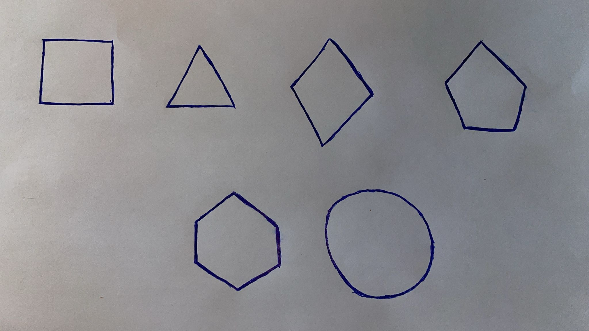

Proje Hakkında

--- 2 farklı kişiden elde ettiğim el çizimlerinin testleri mevcut.

--- İki klasördeki kod da aynı ancak tolerans, threshold, kernel, area ve preprocessing(morfolojik işlemler) değerlerinde fotoğrafa özel optimizasyon uyguladım.

--- geoshape2 kodunda açıklama satırlarıyla kodu daha anlaşılır hale getirdim.(okuması daha anlaşılır)

--- Douglas peucker algoritması tercih ettim çünkü elle çizilen fotoğraflarda çıkıntılar sebebiyle köşe bulmak çok zor.

--- debug etmem sonucunda kontur noktalarına baktığımda başlangıç ve bitiş noktalarını 2 kere saydığını fark ettim bu yüzden o noktaları kaldıracak bir fonksiyon yazdım.

--- köşe olmayan hatalı noktaları da diğer noktalarla açılarına bakarak belirli eşiğin üstünde olanları yazdığım fonksiyon ile temizledim.

--- detect_shape fonksiyonu ile şekillerin tespitini yaptım.

	-- daire tespitini çok rahat yapabilmesi sebebiyle circularity formulü uyguladım.

	-- şekilleri bulurken ana amacım köşe tespiti ile bulması. bulamadığı durumlarda şekilin ratiosuna ((perimeter²) / area) bakıp tahmin etmesi.

--- Sonuç olarak temiz ışıkla çekilmiş fotoğraflarda optimizasyon sonucunda doğru sonuçları rahatlıkla vermekte.

